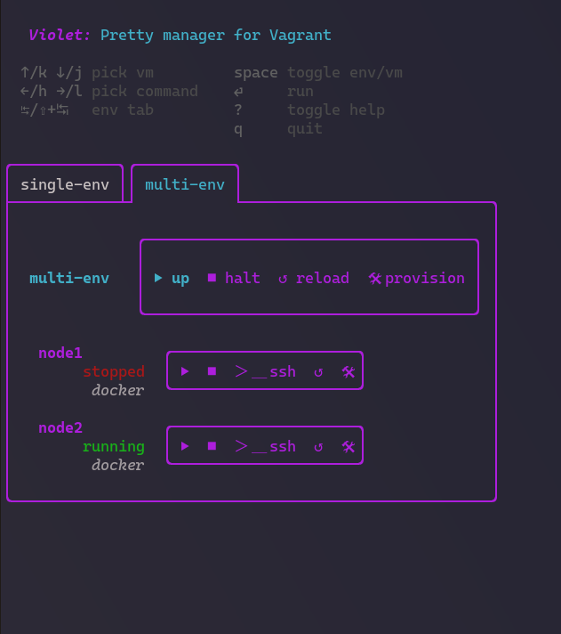

# Violet
Give [Vagrant](https://developer.hashicorp.com/vagrant) a splash of color :art:

Violet is a colorful TUI frontend to manage Vagrant virtual machines. Quickly view the state of all VMs and issue commands against them!



## Getting Started

Violet is delivered as a single binary for various platforms. See the [Releases](https://github.com/braheezy/violet/releases) page for the latest builds.

### Prerequisites

Violet does absolutely nothing without Vagrant installed. See the [Vagrant docs](https://developer.hashicorp.com/vagrant/downloads) to install it for your platform.

Vagrant itself does absolutely nothing unless you have a Hypervisor installed and configured. Here's a few popular ones:
- [VirtualBox](https://www.virtualbox.org/)
- [Libvirt/QEMU](https://libvirt.org/)

For best results, it helps to have existing Vagrant VMs.

### Usage
Open a terminal and run the program:

    violet

See the following table for how to interact with Violet:
| Action                  | Key        | Description                                               |
|-------------------------|------------|-----------------------------------------------------------|
| Switch Environment Tab  | Tab/Shift+Tab | Cycle through found Vagrant environments       |
| Select Command | Left/Right | Cycle through the supported Vagrant commands |
| Run command | Enter | Run the highlighted command on the selected entity |
| Toggle Environments/VM control | Space bar | Operate on the environment as a whole or individual machines |


Note that Violet does not aim to support all Vagrant commands and will provide a poor interface for troubleshooting issues with Vagrant, VMs, hypervisors, etc.

## Development

The `Makefile` contains the most common developer actions to perform. See `make help` for everything, or build and run for your machine:

    make run

Using the `Vagrantfile`, a Libvirt VM can be created and inside that, scripts from `test/` can create quick dummy Vagrant projects. This can be a safe sandbox environment to experiment with builds of `violet`.

```bash
# Bring VM up and SSH in
vagrant up && vagrant ssh
# Get into the working directory
cd /vagrant
# Setup test environments
bash test/multi_env.sh
# Make edits, then run
make run
```

| Test Script | Purpose |
| --- | --- |
| `single_env.sh` | Create one env with one machine
| `multi_env.sh` | Create one env with multiple machines
| `many_env.sh` | Create multiple envs, each with one machine

## Acknowledgements

* [bubbletea](https://github.com/charmbracelet/bubbletea) - Main TUI framework
* [lipgloss](https://github.com/charmbracelet/lipgloss) - Styling and colors
* [bubbletint](https://github.com/lrstanley/bubbletint) - Pre-made lipgloss colors
* [bubblezone](https://github.com/lrstanley/bubblezone) - Rich mouse tracking

## Contributing

Please do! Issues and PRs are very welcome.

## Inspiration
My interest in TUI applications was growing and I wanted to build something complicated and useful (more than a [game](https://github.com/braheezy/hangman)).
